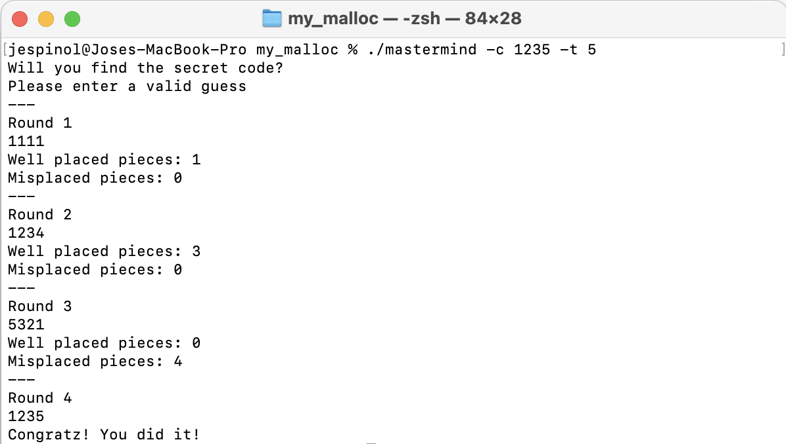
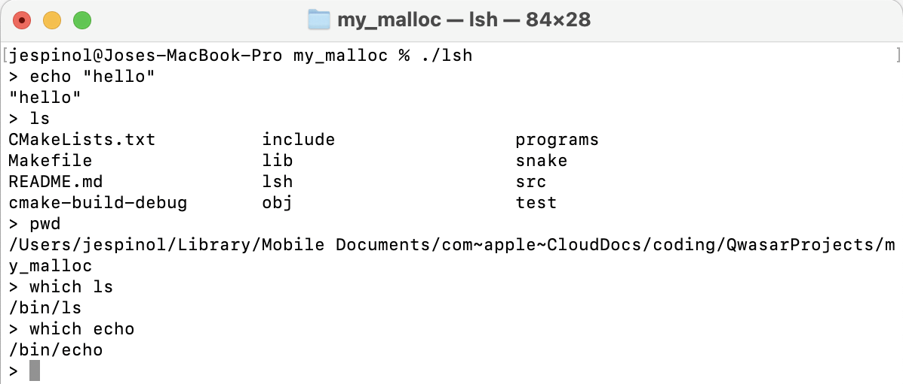
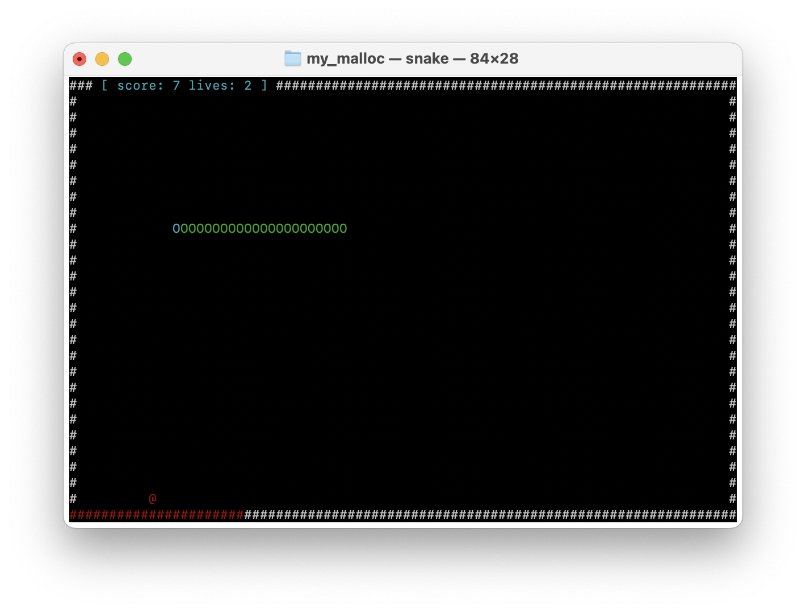

# My Malloc
***

## Task
This project aims to implement a custom memory allocator in `C`, addressing challenges related to efficient memory management, allocation, and deallocation. The primary goal is to create a memory allocation system capable of handling dynamic memory requests while minimizing syscalls.

## Description
The allocator relies on two core structures: the `struct MemoryBlock` array and a hash table of `struct address`. The `MemoryBlock` array manages available memory, holding crucial metadata for each block (address, size, allocation status, and adjacent block and contents pointers). Allocation involves finding suitable unallocated blocks, managing sizes, potential fragmentation, and merging adjacent free blocks. A parallel hash table aids block lookup, storing addresses and keys for quick retrieval. Deallocation marks blocks as free, optimizing memory and addressing fragmentation, while removing addresses from the hash table.

This memory allocator manages a fixed amount of memory, 100 MiB as specified by `MEMORY_SIZE` found in the header file `./include/memory_blocks.h`, and a maximum number of allocated addresses, 1024 as specified by `HASH_TABLE_SIZE` found in the header `./include/memory_addresses.h`.

***NOTE: This implementation appears to be significantly more stable in macOS compared to docode's environment using the same compilation flags.***

## Installation
To compile this project follow these steps:
1. Clone the repository or manually copy the project files if needed
2. Navigate to the project directory
3. Run one of the following commands:
   1. `make` The alloc library is compiled and linked to test code to show different behaviors of the allocation functions. This will create an executable found in `./my_malloc`.
   2. `make lib` The alloc functions are compiled into a static library for usage with other projects. The output file will be located in `./lib/liballoc.a`.

## Usage
### Builtin tests
If the user compiles the tests, executing `./my_malloc` will print details and outputs of the tests to the console. Alternatively, if the user wishes to run custom tests in this manner, code can be added to the source file `./test/tests_all.c`.

### As a library
If the user compiles a static library, the `./lib/liballoc.a` can be linked to other projects that include the headers found in `./include`. For a program such as:
```c
#include "/path/to/my_malloc.h"
#include "/path/to/my_free.h"

int main(void) {
    char *str = my_malloc(100);
    my_free(str);
    
    return 0;
}
```
running
```
gcc my_program.c -L path/to/liballoc/ -lalloc -o my_program
```
will create the executable `my_program` that uses the library.
### With example programs
To further test the allocator capabilities and robustness with my own programs and (less predictable) programs written by others, I included a number of programs that require these functions. These are found in the directory `./programs`. I modified each program to replace default alloc calls for my own implementations and minimal modifications to make them functional, if needed. I was able to  run these programs successfully in my local environment.

To compile these example programs use the following commands. First run,if needed:
```
cd /path/to/this/repo
make lib
```
then, to create executables in the current directory run:
- `mastermind` a clone of the classic mastermind game developed by myself as an assignment for Qwasar.
  
   `gcc programs/mastermind.c -L lib -l alloc -o mastermind`

    


- `lsh` a simple shell implementation

   `gcc programs/lsh.c -L lib -l alloc -o lsh`

    


- `snake` an ncurses implementation of the snake game. **Might required multiple attemps to start in linux**

  `gcc programs/snake.c -lncurses -lm -L lib -l alloc -o snake`

    

## TODO
This memory allocator has several opportunities for improvement:
1. Managed memory size: Implement dynamic memory management to handle varying memory sizes, allowing the allocator to handle more or less memory as required. This also includes improving hash collision handling to increase the total number of addresses that can be managed at once.
2. Allocation algorithms: Explore and implement faster allocation algorithms (e.g., buddy allocation, segregated free lists) to enhance memory allocation speed and efficiency.
3. Fragmentation handling: Develop strategies to minimize memory fragmentation, ensuring better utilization of available memory space.
4. Resizable blocks: Enable blocks to dynamically resize based on allocation needs (e.g., when calling `realloc`) to optimize memory usage.
5. Memory protection: Implement memory protection mechanisms to prevent unauthorized access, buffer overflows, and other security vulnerabilities.
6. Error handling: Strengthen error handling mechanisms and debugging tools to identify and rectify memory-related issues more effectively.
7. Portability: Ensure compatibility across different platforms and systems.
8. Thread safety: Ensure the allocator has support for multi-threaded environments.

<br><br>
***
#### [Jose M. Espinola Lopez](https://github.com/jespinol)


<span><i>Made at <a href='https://qwasar.io'>Qwasar SV -- Software Engineering School</a></i></span>
<span></span>